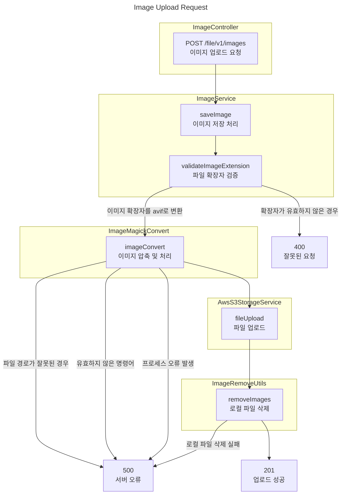
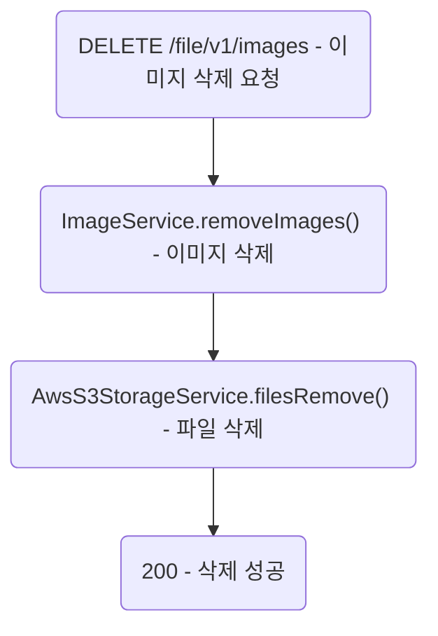

# Image Controller

## Upload Image Request

```mermaid
---
title: "Image Upload Request"
---
flowchart TD
    Request[POST /file/v1/images </br> 이미지 업로드 요청]
    Service[saveImage </br> 이미지 저장 처리]
    Validate[validateImageExtension </br> 파일 확장자 검증]
    ImageMagic[imageConvert </br> 이미지 압축 및 처리]
    Upload[fileUpload </br> 파일 업로드]
    Remove[removeImages </br> 로컬 파일 삭제]
    Success[201 </br> 업로드 성공]
    BadRequest[400 </br> 잘못된 요청]
    ServerError[500 </br> 서버 오류]
    subgraph ImageController
        Request
    end
    Request --> Service

    subgraph ImageService
        Service --> Validate
    end
    Validate -- 확장자가 유효하지 않은 경우 --> BadRequest
    Validate -- 이미지 확장자를 avif로 변환 --> ImageMagic

    subgraph ImageMagickConvert
        ImageMagic
    end
    ImageMagic -- 파일 경로가 잘못된 경우 --> ServerError
    ImageMagic -- 유효하지 않은 명령어 --> ServerError
    ImageMagic -- 프로세스 오류 발생 --> ServerError
    ImageMagic --> Upload

    subgraph AwsS3StorageService
        Upload
    end
    Upload --> Remove

    subgraph ImageRemoveUtils
        Remove
    end
    Remove -- 로컬 파일 삭제 실패 --> ServerError
    Remove --> Success
```

## Delete Image Request

```mermaid
flowchart TD
    Request("DELETE /file/v1/images - 이미지 삭제 요청")
    Service("ImageService.removeImages() - 이미지 삭제")
    Remove("AwsS3StorageService.filesRemove() - 파일 삭제")
    Success("200 - 삭제 성공")
    Request --> Service --> Remove --> Success
```
